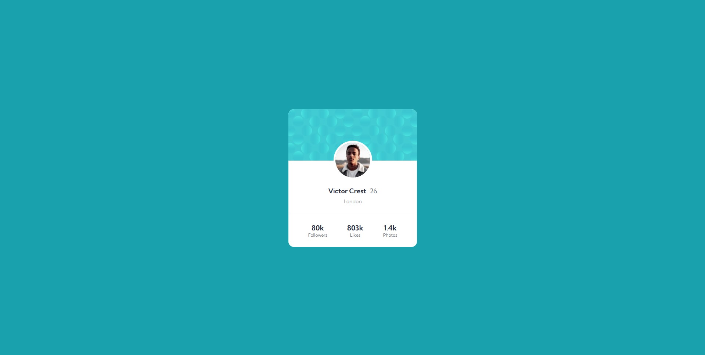

# Frontend Mentor - Profile card component 

Essa é a minha solução para o desafio [Profile card component challenge on Frontend Mentor](https://www.frontendmentor.io/challenges/profile-card-component-cfArpWshJ).

## Sumário

- [Visão Geral](#visão-geral)
  - [Desafio](#desafio)
  - [Print](#print)
  - [Links](#links)
- [Meu processo](#meu-processo)
  - [Tecnologias](#tecnologias)
  - [Pratica de Aprendizado](#pratica-de-aprendizado)
  - [Habilidades em Desenvolvimento](#habilidades-em-desenvolvimento)
- [Autor](#autor)
- [Agradecimentos](#agradecimentos)

## Visão Geral

### Desafio

- Fazer o projeto da maneira mais fiel possível ao design dado.

### Print



### Links

- Solução: [Ir para solução](https://vinicius-b-oliveira.github.io/profile-card/)

## Meu Processo

### Tecnologias

- Marcação semantica com HTML 5
- Folhas de estilo em cascata no CSS 3
- Estilos flexiveis usando CSS Flexbox
- Armazenamento de propriedades usando variáveis CSS
- Git para versionamento de código

### Pratica de Aprendizado

Com esse projeto foi possível praticar algumas tecnologias CSS como o flex box por exemplo, além do posicionamento de imagens usando position relative e absolute em conjunto. 

Segue abaixo um trecho de código com os conhecimentos relatados acima: 
```css
.profile-card .infos {
    display: flex;
    flex-direction: column;
    align-items: center;
    position: relative;
    padding: 67px 0 25px 0;
    border-bottom: 1px solid var(--neutral-soft-color);
}

.profile-card .infos .avatar {
    width: 105px;
    position: absolute;
    border-radius: 50%;
    border: 5px solid white;
    top: -58px;
}
```

### Habilidades em Desenvolvimento

Mesmo contente com o resultado obtido, acredito que o "Clean Code" ainda é algo que pretendo sempre melhorar. Estarei sempre na busca por escrever códigos limpos e fáceis de entender. 

## Autor

- Github - [Vinicíus Bueno](https://github.com/Vinicius-b-oliveira)
- Frontend Mentor - [Vinicíus Bueno](https://www.frontendmentor.io/profile/Vinicius-b-oliveira)

## Agradecimentos

Projeto realizado durante o curso de programação [Dev Quest](https://devemdobro.com/matriculas-abertas/) sobre mentoria dos gêmeos Ricardo Dias e Roberto Dias. 
